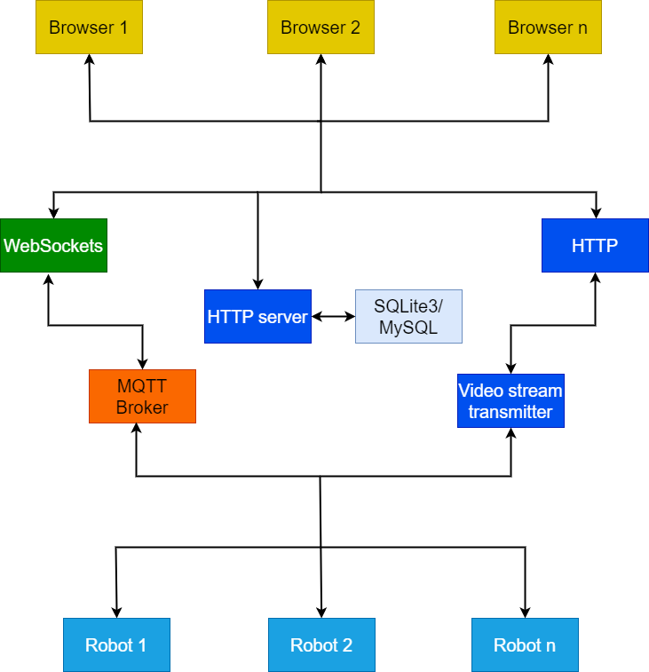

# Information system for remote play of robofootball

This system allow robofootball players play robofootball remotely using the internet.

## Infological model



The main part of my project is HTTP server. First time you connect to HTTP server you need to register and then login.
After that your username and email stores in database and you gets a unique string identefier. Using this identefier 
robot can send messages through MQTT broker, because I use this identifier as a topic for MQTT broker, so robot subscibes
to this topic and recives data from MQTT broker and user from the browser send data to MQTT broker using this topic.

On the right side of the model you can see the "Video stream transmitter", it is my another project which used for transmitting
the video from ESP32-CAM to the browser. ESP32-CAM is used as FPV(first person view) camera for the robot. You can see more about this here -> https://github.com/kalugin-stepan/cam_server.

## Dependencies

* Node.js
* MySQL (optial)
* MQTT broker (optional)

## Usage

First you need to edit ```config.json```.
Here you can enable or disable MySQL (you can use SQLite instead), email confirmation and video transmitting.
Also you should type the hostname in it.

Then you should install Node.js dependencies using npm(```npm i```) or yarn (```yarn```).

### Starting the system
```bash
    pm2 start ./dist/index.js --name controller
```

### Stoping the system

```bash
    pm2 stop controller
```

### Restarting the system

```bash
    pm2 restart controller
```
